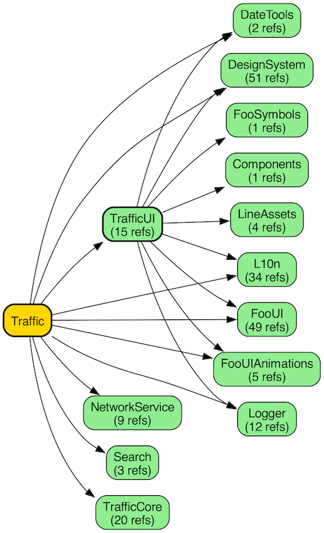

## swift_dependency_analyzer

This script recursively reads all `import` declarations in your Swift files from a specified input path and uses the [DOT language](https://graphviz.org/doc/info/lang.html) to generate and visualize the corresponding dependency graph.

> ⚠️ This script relies solely on your project's folder hierarchy to match module names. It does not perform static analysis or attempt to build the project.  
> You can use options like `--prefer-root` to capture a name from a path and use it as a specific module name when necessary (default: root of the path use as module name).



### Options

```
-o, --output <file>                       - Output DOT file (default: dependencies.dot)
```

Use the `-o` option to explicitly specify the output location for your generated dot file.

```
-e, --exclude <regex>                     - Exclude path or modules matching pattern (can be used multiple times). Support regex.
                                                Example: *Tests, Test*, *Mock*"
```

Use the `-e` option to exclude some path(s) or module(s) from your analysis, you can use it multiple times inside of a same command. It also supports regex matching.
`Ex: ./swift_dependency_analyzer.sh ./project --exclude '*Tests' --exclude '*Mocks'`

``` 
--include-system-framework                          - Include system frameworks in the graph (default: off)"
```

Use the `--include-system-framework` option to include system frameworks (like SwiftUI, UIKit, Combine, ...) in your dependency graph.

```
--prefer-root <regex>                     - Extract root module name using regex (use parenthesis to capture) from path
                                          Can be specified multiple times. First matching pattern is used.
                                          Example: '^Targets/([^/]+)/' or '^Toolkit/Sources/([^/]+)/'
```

Use `--prefer-root` to capture a name from a path and use it as a specific module name when your folder hierarchy names don’t match your module names. You can use this option multiple times within the same command. It also supports regex matching.

By default, swift_dependency_analyzer uses the root folder name of the path as the module name, but this isn’t always desirable—such as when working with a Swift Package that contains multiple modules.

Let's consider a concrete example—this could be a project you might have.

```
MyProject
└ App
	└ Camera
	└ Map
└ Authentication
	└ Sources
		└ AuthenticationUI
		└ AuthenticationCore
	└ Tests
		└ ...
└ Payment
	└ Sources
		└ PaymentUI
	└ Tests
		└ ...
```

Which could be written like so

```
App/Camera
App/Map
Authentication/Sources/AuthenticationUI
Authentication/Sources/AuthenticationCore
Authentication/Tests/...
Payment/Sources/PaymentUI
Payment/Tests
```

By default swift_dependency_analyzer will use root folder as name of a module. So by default there is 3 modules considered by the script: `App`, `Authentication`, `Payment`

Most of the time it is OK, but we could prefer avoid root for some paths. You can use `--prefer-root` in that case:
In our example using `--prefer-root '/Sources/([^/]+)/'` will capture chars after `/Sources` until next `/` is reached and use it as module name instead of the root folder.
Resulting in: `App`, `AuthenticationUI`, `AuthenticationCore`, `PaymentUI`

### Usage

```
./swift_dependency_analyzer.sh ./my-app

./swift_dependency_analyzer.sh ./my-app -o custom_deps.dot

./swift_dependency_analyzer.sh ./my-app --exclude '*Tests'

./swift_dependency_analyzer.sh ./my-app --exclude '*Tests' --exclude '*Mocks' -o deps.dot --include-system-framework

./swift_dependency_analyzer.sh ./my-app --prefer-root '^Targets/([^/]+)/' --prefer-root '^Toolkit/Sources/([^/]+)/'

./swift_dependency_analyzer.sh ~/Documents/my-app --include-system-framework --exclude "*Tests*" --prefer-root "Sources/([^/]+)/"

./swift_dependency_analyzer.sh ~/Documents/my-app\
 --exclude '*Tests*'\
 --exclude '*Firebase*'\
 --exclude '*PhoneNumber*'\
 --exclude 'Didomi'\
 --exclude 'Swinject'\
 --exclude 'Batch'\
 --exclude 'AdjustSdk'\
 --exclude 'SVGView'\
 --exclude 'Kingfisher'\
 --exclude 'GoogleMobileAds'\
 --exclude 'JWTDecode'\
 --exclude 'Alamofire'\
 --exclude 'BatchExtension'\
 --exclude 'Lottie'\
 --prefer-root '^Targets/([^/]+)/'\
 --prefer-root '/Sources/([^/]+)/'
```